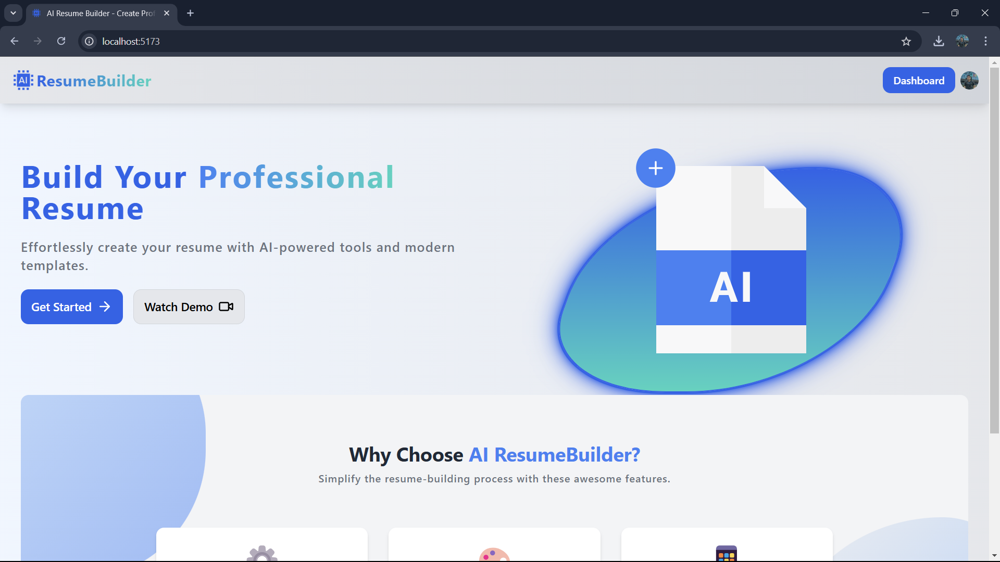

Here’s a **super clean, cool, and helpful README** file for your **AI Resume Builder** project, following the structure and style you've shared:

---

# AI Resume Builder 🚀

Welcome to the **AI Resume Builder**! This project is a cutting-edge web application that allows users to create professional resumes with the power of AI. With a modern UI, seamless user experience, and powerful features, the app is designed to simplify the resume-building process and help users stand out in their job search.

**Live Demo:** [Coming Soon!]()



---

## Introduction 📜

The **AI Resume Builder** is a robust tool for creating stunning resumes. Built with React and TypeScript, it leverages AI to generate summaries, skills, and other resume content. The application features real-time previews, interactive animations, and dynamic forms to make resume creation an intuitive and enjoyable experience.

This project highlights advanced state management, modern UI patterns, and creative implementations of AI, making it an excellent foundation for learning and innovation.

---

## Features ✨

- **Dynamic Forms:**
  - Comprehensive form sections for personal data, experience, skills, projects, and more.
  - Built with `react-hook-form` and `Yup` for robust validation and smooth user interactions.

- **AI-Powered Summaries:**
  - Generates professional summaries using the **Google Generative AI API**.
  - Real-time content updates with animations using **Framer Motion**.

- **Live Preview:**
  - Real-time resume preview powered by React context.
  - Fully responsive and styled with Tailwind CSS for a polished look.

- **Interactive Animations:**
  - Smooth transitions and realistic AI-generating effects using **Framer Motion**.
  - Dynamic section navigation with engaging animations.

- **Rich Text Editor:**
  - Integrated WYSIWYG editor for detailed experience descriptions.

- **Customizable Resume:**
  - Add, reorder, and remove sections dynamically.
  - Includes features like star ratings for skills and customizable inputs for various fields.

- **PDF Export:**
  - Easily export resumes to PDF using **html2pdf.js** for sharing and printing.

- **Modern UI & Accessibility:**
  - Fully responsive and accessible design.
  - Styled with Tailwind CSS, using a BEM-like class naming convention.

---

## Technologies Used 🛠️

This project incorporates the following technologies:

- ⚛️ **React.js**: A JavaScript library for building user interfaces.
- 🚀 **Vite**: A fast build tool for modern web applications.
- 🌐 **TypeScript**: A statically-typed superset of JavaScript.
- 🎨 **Tailwind CSS**: A utility-first CSS framework for rapid UI development.
- 🛠️ **react-hook-form**: Simplifies form handling and validation.
- ✨ **Framer Motion**: Adds animations to enhance user experience.
- 🤖 **Google Generative AI API**: Powers AI-based content generation.
- 🖋️ **WYSIWYG Editor**: Rich text editing using `react-simple-wysiwyg`.
- 📜 **Yup**: Schema-based validation for forms.
- 📄 **html2pdf.js**: Converts HTML resumes to downloadable PDFs.
- 🔔 **React Toastify**: Modern and customizable notifications.

---

## Demo 🌐

Stay tuned for the **live demo** link! You’ll soon be able to create and share your resumes directly from the app. 🚀

---

## Getting Started 🚀

To run the project locally, follow these steps:

1. **Clone the repository**:
   ```bash
   git clone git@github.com:mahmoud-saeed1/ai-resume-builder.git
   ```

2. **Navigate to the project directory**:
   ```bash
   cd ai-resume-builder
   ```

3. **Install dependencies**:
   ```bash
   npm install
   ```
4. **Rename the environment file and obtain API keys**:  
- Rename the `.env.example` file to `.env` by running:

   ```bash
   mv .env.example .env 
   ```
- Gemini API Key: Get your Gemini API key [here](https://aistudio.google.com/app/apikey).
- Clerk Publishable Key: Get your Clerk publishable key here [here](https://clerk.com/).

5. **Start the development server**:
   ```bash
   npm run dev
   ```

6. **Open your browser**:
   ```bash
   http://localhost:3000
   ```

Now you’re ready to explore and build professional resumes with AI assistance! 🎉

---

## Folder Structure 📂

Here's an overview of the project's folder structure for better understanding:

```
ai-resume-builder/
├── public/                 # Static assets like images and icons
├── src/
│   ├── components/         # Reusable React components
│   ├── context/            # Context for state management
│   ├── forms/              # Dynamic form components for each resume section
│   ├── hooks/              # Custom React hooks
│   ├── styles/             # Tailwind CSS styles
│   ├── utils/              # Utility functions
│   ├── validation/         # Yup schemas for form validation
│   └── App.tsx             # Main application file
├── package.json            # Project dependencies and scripts
└── vite.config.ts          # Vite configuration
```

---

## Contributing 🤝

Contributions are welcome! Here’s how you can contribute:

1. Fork the repository.
2. Create a new branch for your feature or bug fix:
   ```bash
   git checkout -b feature-name
   ```
3. Commit your changes:
   ```bash
   git commit -m "Add a feature-name"
   ```
4. Push your branch:
   ```bash
   git push origin feature-name
   ```
5. Open a pull request. Let’s collaborate to make the AI Resume Builder even better! 🙌

---

## Acknowledgements 💡

Special thanks to the following libraries and tools that made this project possible:

- [React.js](https://reactjs.org/)
- [Tailwind CSS](https://tailwindcss.com/)
- [Framer Motion](https://www.framer.com/motion/)
- [Google Generative AI API](https://developers.google.com/generative-ai)
- [react-hook-form](https://react-hook-form.com/)
- [Yup](https://github.com/jquense/yup)

---

## License 📝

This project is licensed under the MIT License. See the [LICENSE](LICENSE) file for details.

---

Thank you for using the **AI Resume Builder**! Let’s create stunning resumes together. ✨

--- 

What do you think? 😊